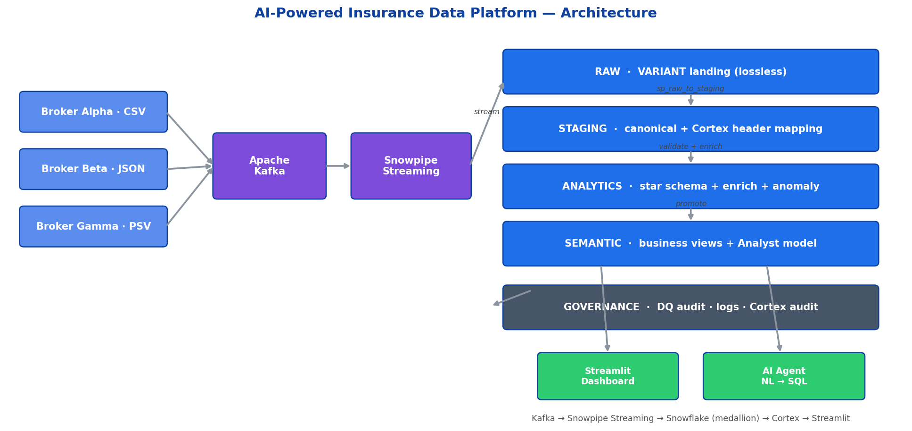
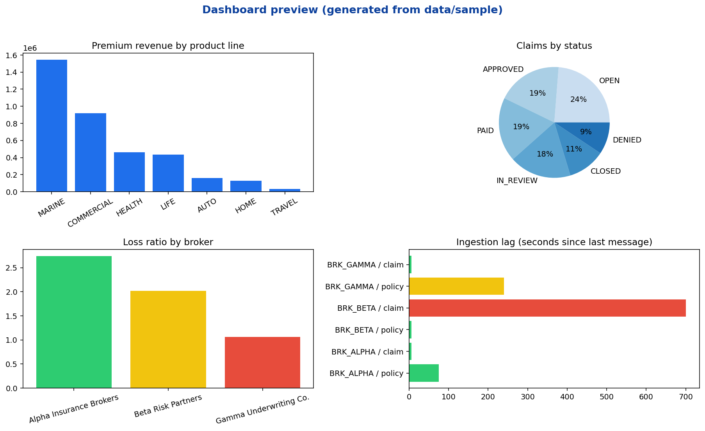

# 🛡️ AI-Powered Insurance Data Platform

A production-style, real-time insurance data platform that ingests **policy** and
**claims** data from multiple brokers through **Apache Kafka**, streams it into
**Snowflake** via **Snowpipe Streaming**, standardizes disparate broker formats
into a **semantic data model**, and applies **Snowflake Cortex** (LLM) for
header mapping, product classification, enrichment, anomaly detection, and
natural-language validation explanations.

It ships with a **configurable data-quality framework**, a **conversational AI
agent** (natural language → SQL → business answer), and a **Streamlit dashboard**
for real-time operational and business metrics.

> **▶ Live demo:** deploy in ~2 minutes on [Streamlit Community Cloud](https://share.streamlit.io)
> (main file path: `dashboard/app.py`). The hosted app runs on the bundled
> synthetic dataset — no Snowflake account required. See
> [Deploy the dashboard](#-deploy-the-dashboard-streamlit-community-cloud).



---

## ✨ What this demonstrates

| Capability | How it is implemented |
|---|---|
| **Enterprise data engineering** | Layered medallion architecture (`RAW → STAGING → ANALYTICS → SEMANTIC`) with audited transformations via stored procedures |
| **Real-time ingestion** | Kafka topics → Snowpipe Streaming (rowset API) → `RAW` tables in seconds |
| **AI-driven data processing** | Cortex `COMPLETE`, `CLASSIFY_TEXT`, `EXTRACT_ANSWER`, `SENTIMENT` for mapping, classification, enrichment, anomaly detection |
| **Semantic modeling** | Broker-agnostic `CUSTOMER`, `POLICY`, `CLAIM` entities + a Cortex Analyst semantic model |
| **Data quality** | YAML-configured rules engine writing to dedicated `GOVERNANCE` audit tables, with LLM-generated failure explanations |
| **Conversational analytics** | Cortex-powered NL→SQL agent with guardrails over the semantic layer |
| **Real-time analytics** | Streamlit dashboard: policy/claim volume, premium revenue, validation errors, broker performance, ingestion health |

---

## 🏗️ Architecture

```
                     ┌──────────────┐   ┌──────────────┐   ┌──────────────┐
   Broker A (CSV) ──▶│              │   │              │   │              │
   Broker B (JSON)──▶│  Kafka       │──▶│  Snowpipe    │──▶│  Snowflake   │
   Broker C (XML) ──▶│  Topics      │   │  Streaming   │   │  RAW schema  │
                     └──────────────┘   └──────────────┘   └──────┬───────┘
                                                                  │ sp_raw_to_staging
                                       ┌──────────────────────────▼───────────────┐
                                       │  STAGING  (Cortex header mapping +        │
                                       │            type-cast + standardization)   │
                                       └──────────────────────────┬───────────────┘
                                            sp_run_data_quality    │ sp_staging_to_analytics
                  ┌────────────────────┐                          │
                  │ GOVERNANCE         │◀── DQ results + Cortex ───┤
                  │ (audit / DQ / log) │    failure explanations   │
                  └────────────────────┘                          ▼
                                       ┌──────────────────────────────────────────┐
                                       │  ANALYTICS  (conformed facts/dims,        │
                                       │   Cortex classification + enrichment +    │
                                       │   anomaly scores)                         │
                                       └──────────────────────────┬───────────────┘
                                                                  ▼
                                       ┌──────────────────────────────────────────┐
                                       │  SEMANTIC  (business views + Cortex       │
                                       │   Analyst semantic model)                 │
                                       └─────────┬───────────────────────┬─────────┘
                                                 ▼                       ▼
                                       ┌──────────────────┐   ┌────────────────────┐
                                       │ Streamlit        │   │ Conversational AI  │
                                       │ Dashboard        │   │ Agent (NL → SQL)   │
                                       └──────────────────┘   └────────────────────┘
```

See [`docs/ARCHITECTURE.md`](docs/ARCHITECTURE.md) for the full diagram and data flow,
and [`docs/diagrams/`](docs/diagrams/) for editable Mermaid sources.

---

## 📁 Repository layout

```
Snowflake_AI/
├── config/                 # YAML config: broker mappings, DQ rules, app settings
├── sql/                    # DDL for every schema + stored procedures + semantic model
│   ├── procedures/         # Transformation, DQ, and Cortex stored procedures
│   └── semantic/           # Cortex Analyst semantic model YAML
├── kafka/                  # Producers + broker simulator + sample broker files
│   └── producers/
├── ingestion/              # Snowpipe Streaming client + Kafka Connect sink config
├── cortex/                 # Cortex prompt templates + Python client wrapper
│   └── prompts/
├── chatbot/                # NL→SQL conversational agent
├── dashboard/              # Multi-page Streamlit dashboard + AI assistant
│   ├── pages/
│   └── utils/
├── data/sample/            # Generated dummy dataset (powers the hosted demo)
├── src/common/             # Shared Python utilities (config, logging, snowflake conn)
├── scripts/                # Bootstrap / deploy helper scripts
├── tests/                  # Unit tests for mapping, DQ, and NL→SQL guardrails
└── docs/                   # Architecture, data model, deployment, Cortex docs
```

---

## 🖥️ Dashboard preview

The dashboard (5 pages: Overview, Ingestion Health, Broker Performance, Data
Quality, AI Assistant) renders entirely on the bundled synthetic dataset, so you
can run it with **zero infrastructure**.



---

## ⚡ See it in 60 seconds (no Snowflake, no Kafka)

```bash
python -m venv .venv && source .venv/bin/activate
pip install -r requirements.txt           # lean dashboard runtime only
python scripts/generate_sample_data.py    # writes data/sample/*.csv (already committed)
streamlit run dashboard/app.py            # open http://localhost:8501
```

The app auto-detects there's no Snowflake connection and loads `data/sample/`.
The **AI Assistant** answers the example questions using an offline demo agent;
the full Cortex NL→SQL agent activates automatically when Snowflake creds are set.

---

## ☁️ Deploy the dashboard (Streamlit Community Cloud)

1. Push/fork this repo to GitHub (already at
   `fai287/Snowflake-CortexAi-Mapper`).
2. Go to **[share.streamlit.io](https://share.streamlit.io)** → **New app**.
3. Pick the repo, branch `main`, and set **Main file path** to
   **`dashboard/app.py`**.
4. Click **Deploy**. Streamlit installs the lean root `requirements.txt` and the
   app comes up populated with the committed sample data — nothing else to
   configure.
5. *(Optional)* to point the hosted app at a live warehouse, add Snowflake
   secrets in the app's **Settings → Secrets** as environment variables
   (`SNOWFLAKE_ACCOUNT`, `SNOWFLAKE_USER`, `SNOWFLAKE_PASSWORD`, …).

---

## 🚀 Full platform (live Kafka → Snowpipe Streaming → Snowflake → Cortex)

> Full instructions: [`docs/DEPLOYMENT.md`](docs/DEPLOYMENT.md)

### 1. Prerequisites
- Snowflake account with **Cortex** enabled (region that supports `COMPLETE`/`CLASSIFY_TEXT`)
- Python 3.10+
- Docker (for local Kafka) **or** an existing Kafka cluster
- A Snowflake user with key-pair auth (required by Snowpipe Streaming)

### 2. Install
```bash
python -m venv .venv && source .venv/bin/activate
pip install -r requirements-dev.txt   # full stack: Snowflake + Kafka + ingest
cp .env.example .env                   # fill in Snowflake + Kafka credentials
```

### 3. Provision Snowflake
```bash
# Runs every SQL file in order against your account
./scripts/deploy_snowflake.sh
```

### 4. Start Kafka + produce broker traffic
```bash
docker compose up -d                       # Kafka + Zookeeper + Kafka UI
python kafka/producers/broker_simulator.py --rate 5   # 5 msgs/sec from all brokers
```

### 5. Stream into Snowflake
```bash
python ingestion/snowpipe_streaming.py     # consumes Kafka → Snowpipe Streaming → RAW
```

### 6. Launch the dashboard + AI agent
```bash
streamlit run dashboard/app.py
```

---

## 🧠 Cortex usage at a glance

| Task | Cortex function | Where |
|---|---|---|
| Map broker headers → canonical fields | `COMPLETE` (JSON-mode) | `sql/procedures/sp_cortex_header_mapping.sql` |
| Classify insurance product (Auto/Home/Life/…) | `CLASSIFY_TEXT` | `sql/procedures/sp_cortex_enrichment.sql` |
| Enrich records (risk tier, segment) | `COMPLETE` | `sql/procedures/sp_cortex_enrichment.sql` |
| Detect anomalies in premium/claim amounts | `COMPLETE` + statistical z-score | `sql/procedures/sp_anomaly_detection.sql` |
| Explain validation failures in plain English | `COMPLETE` | `sql/procedures/sp_run_data_quality.sql` |
| NL → SQL for the agent | `COMPLETE` + semantic model | `chatbot/agent.py` |

---

## 🧪 How to test it

**1. Unit tests** (no infrastructure — validates guardrails, config consistency, broker reshaping):
```bash
pip install -r requirements-dev.txt
pytest -q                 # 19 tests
```

**2. Dashboard smoke test** (renders on the synthetic dataset):
```bash
python scripts/generate_sample_data.py
streamlit run dashboard/app.py
```
Check each sidebar page loads, then on **AI Assistant** click the example
questions — you should get answers with the equivalent SQL and a result table.

**3. AI-agent guardrails** (the agent must refuse unsafe SQL):
```bash
pytest tests/test_guardrails.py -v
# verifies DELETE/UPDATE/DROP/CALL and RAW/STAGING/ANALYTICS access are blocked,
# multiple statements rejected, and LIMIT auto-applied to row queries.
```

**4. End-to-end pipeline** (needs Snowflake + Kafka — see [`docs/DEPLOYMENT.md`](docs/DEPLOYMENT.md) §3):
```bash
make kafka-up && make topics
python kafka/producers/broker_simulator.py --rate 5 --duration 30
python ingestion/snowpipe_streaming.py
# then in Snowflake:
#   CALL GOVERNANCE.SP_RUN_PIPELINE('claude-3-5-sonnet');
#   SELECT * FROM SEMANTIC.INGESTION_HEALTH;
#   SELECT rule_id, cortex_explanation FROM GOVERNANCE.DQ_RESULT WHERE passed=FALSE LIMIT 10;
```

See [`docs/DEPLOYMENT.md`](docs/DEPLOYMENT.md) §3 (Verify) and §5 (Troubleshooting) for the full checklist.

---

## 📚 Documentation

| Doc | Contents |
|---|---|
| [`docs/ARCHITECTURE.md`](docs/ARCHITECTURE.md) | Architecture + data-flow diagrams (Mermaid), component map |
| [`docs/DATA_MODEL.md`](docs/DATA_MODEL.md) | Snowflake schema design, canonical entities, star schema |
| [`docs/DEPLOYMENT.md`](docs/DEPLOYMENT.md) | Step-by-step deploy, verify, operate, troubleshoot |
| [`docs/CORTEX.md`](docs/CORTEX.md) | Cortex functions, prompts, cost controls |
| [`docs/images/`](docs/images/) | Rendered architecture, star-schema, dashboard images |

---

## 📜 License
MIT — see [`LICENSE`](LICENSE). Sample data is synthetic; no real PII is used.
