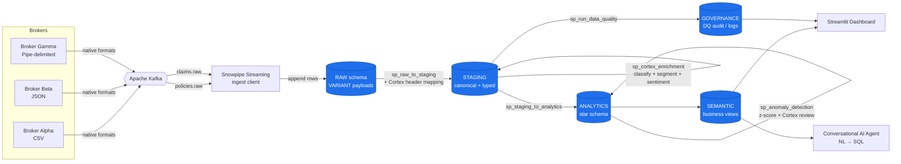
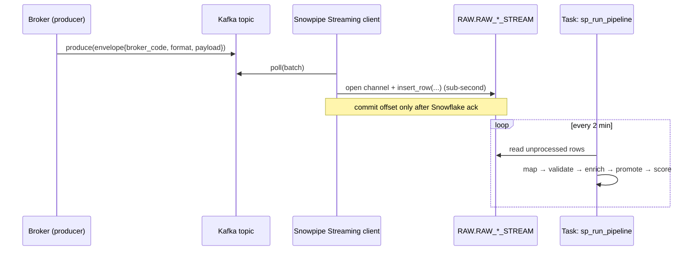
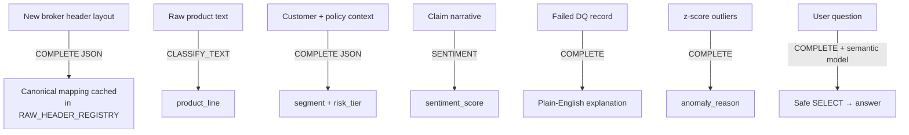

# Architecture

This document is the **Architecture Diagram** deliverable: the end-to-end data
flow, the layered Snowflake design, and the responsibilities of each component.

---

## 1. System overview

---

## 2. Layered (medallion) design

| Schema | Grain / shape | Populated by | Purpose |
|---|---|---|---|
| **RAW** | 1 row per Kafka message, original payload in `VARIANT` | Snowpipe Streaming | Lossless landing zone; nothing is parsed or rejected here |
| **STAGING** | Canonical, typed, broker-agnostic rows | `sp_raw_to_staging` (+ Cortex header mapping) | One shape for all brokers; the layer DQ runs against |
| **ANALYTICS** | Conformed star schema (dims + facts) | `sp_staging_to_analytics` | Query-optimized, enriched, anomaly-scored |
| **SEMANTIC** | Business-named views | DDL views over ANALYTICS + GOVERNANCE | The only surface the dashboard + AI agent touch |
| **GOVERNANCE** | Audit / log tables | DQ engine, pipeline procs | Validation outcomes, ingestion + Cortex audit |

Why a `GOVERNANCE` schema in addition to the four medallion schemas? The brief
calls for **dedicated audit tables**. Keeping DQ results, pipeline logs, and the
rule catalog in their own schema cleanly separates *governance* metadata from
*business* data while leaving `RAW/STAGING/ANALYTICS/SEMANTIC` as the data path.

---

## 3. Real-time ingestion path

Two ingestion backends share one interface (`ingestion/snowpipe_streaming.py`):

1. **Streaming SDK** — production; rows pushed through an open channel.
2. **Connector micro-batch** — local-dev fallback; frequent `INSERT … PARSE_JSON`.

In production the **Snowflake Kafka Connector in Snowpipe Streaming mode**
(`ingestion/kafka_connect_snowpipe.json`) is the recommended managed option.

---

## 4. AI / Cortex touchpoints

Cortex runs **in-database** for row-level work (cheaper, no egress) and from
**Python** only for the interactive agent. Every call is audited in
`GOVERNANCE.CORTEX_CALL_LOG`.

---

## 5. Component map

| Deliverable | Primary artifact(s) |
|---|---|
| Architecture Diagram | this file + `docs/diagrams/*.mmd` |
| Snowflake Database Design | `sql/00`–`sql/06`, `docs/DATA_MODEL.md` |
| Kafka Setup | `docker-compose.yml`, `kafka/producers/*`, `scripts/create_topics.sh` |
| Snowpipe Streaming Integration | `ingestion/snowpipe_streaming.py`, `ingestion/kafka_connect_snowpipe.json` |
| Cortex Header Mapping | `sql/procedures/sp_cortex_header_mapping.sql`, `cortex/prompts/header_mapping.txt` |
| Validation Framework | `config/data_quality_rules.yaml`, `sql/procedures/sp_run_data_quality.sql`, `sql/05_governance_schema.sql` |
| Semantic Layer | `sql/04_semantic_schema.sql`, `sql/semantic/insurance_semantic_model.yaml` |
| AI Agent | `chatbot/agent.py`, `chatbot/guardrails.py` |
| Streamlit Dashboard | `dashboard/app.py`, `dashboard/pages/*` |
| Deployment Guide | `docs/DEPLOYMENT.md`, `scripts/deploy_snowflake.sh` |
